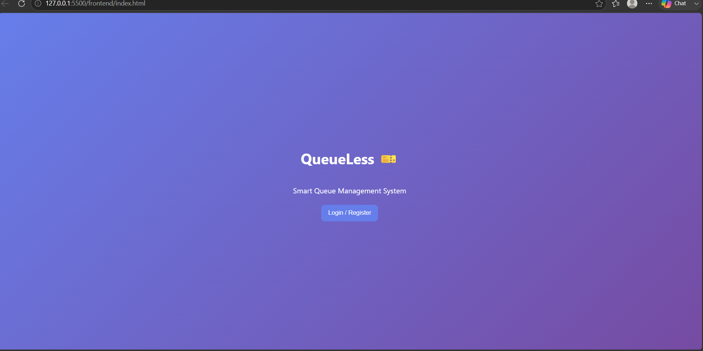
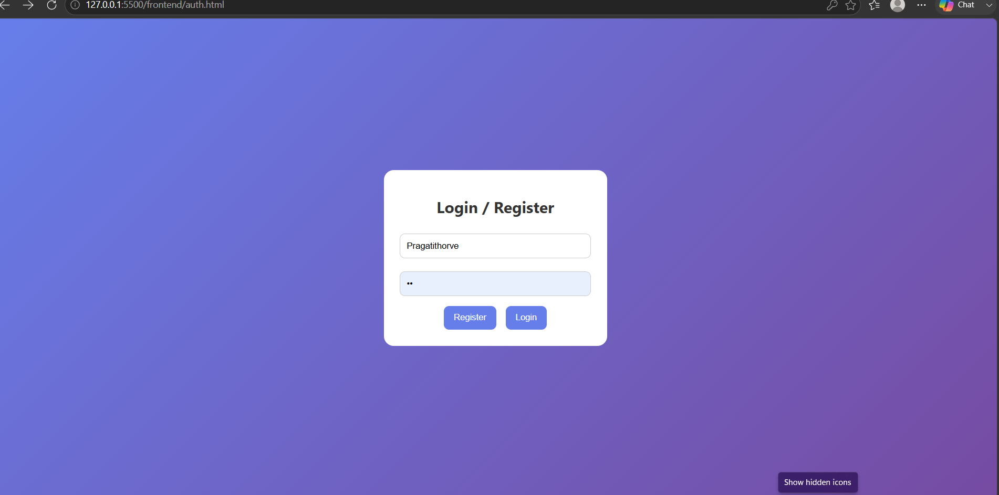
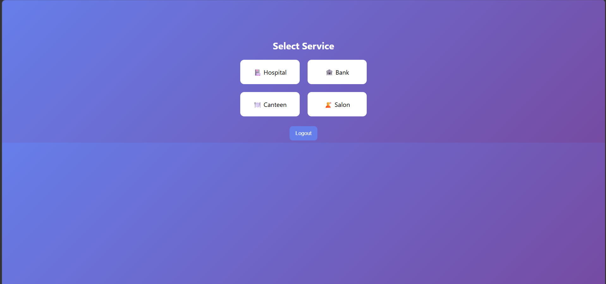
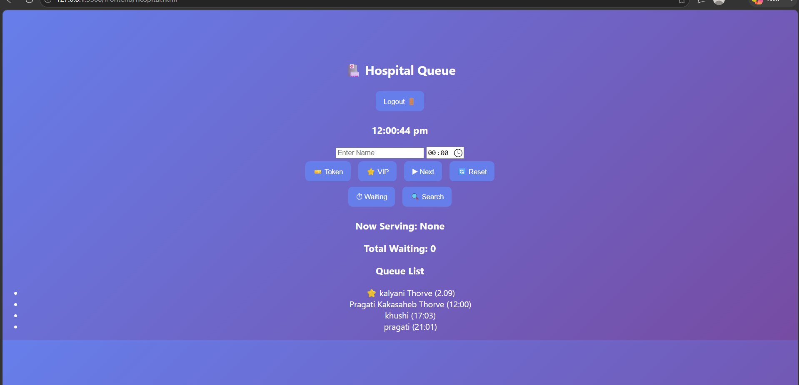
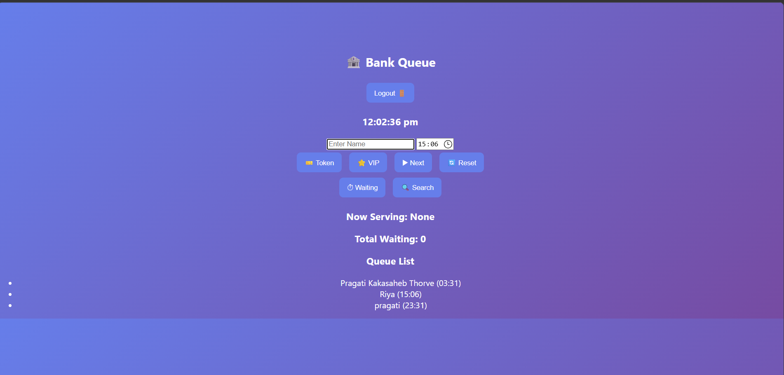
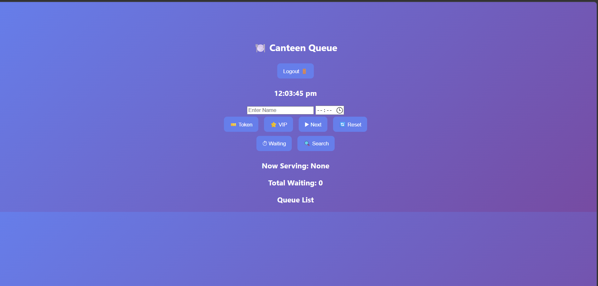
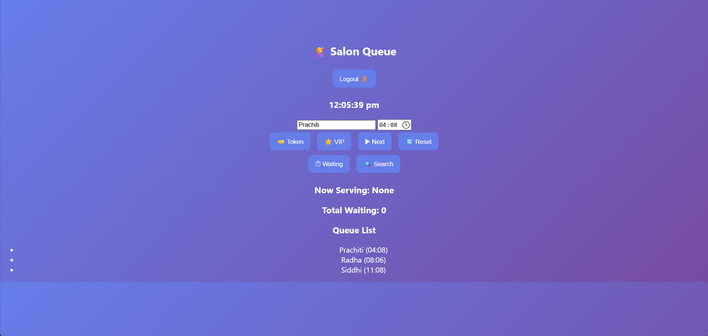

# 🎫 QueueLess

A Smart Queue Management System that helps users book and manage queues online. The system allows users to register, log in, and access different service queues such as Hospital, Bank, Salon, and Canteen, reducing waiting time and improving queue management.

---

## 🚀 Features

- User Registration & Login
- Secure User Authentication
- Hospital Queue Management
- Bank Queue Management
- Salon Queue Management
- Canteen Queue Management
- Services Dashboard
- Simple and User-Friendly Interface

---

## 🛠️ Tech Stack

### Frontend
- HTML5
- CSS3
- JavaScript

### Backend
- Node.js
- Express.js
- REST API

### Database
- MongoDB

### Tools
- Git
- GitHub
- VS Code

---

## 📂 Project Structure

```text
QueueLess/
├── backend/
│   ├── config/
│   ├── models/
│   ├── routes/
│   ├── server.js
│   └── package.json
│
├── frontend/
│   ├── index.html
│   ├── auth.html
│   ├── services.html
│   ├── hospital.html
│   ├── bank.html
│   ├── salon.html
│   ├── canteen.html
│   ├── style.css
│   └── script.js
│
├── screenshots/
│   ├── home.png
│   ├── login.png
│   ├── services.png
│   ├── hospital.png
│   ├── bank.png
│   ├── canteen.png
│   └── salon.png
│
└── README.md
```

---

## ▶️ How to Run

### 1. Clone the Repository

```bash
git clone https://github.com/pragatithorve/QueueLess.git
```

### 2. Open the Project Folder

```bash
cd QueueLess
```

### 3. Install Backend Dependencies

```bash
cd backend
npm install
```

### 4. Start the Backend Server

```bash
node server.js
```

### 5. Open the Frontend

Open `frontend/index.html` using Live Server or any web browser.

---

## 📸 Screenshots

### 🏠 Home Page



### 🔐 Login / Register



### 🛠️ Services Page



### 🏥 Hospital Queue



### 🏦 Bank Queue



### 🍽️ Canteen Queue



### 💇 Salon Queue



---

## 🎯 Future Improvements

- Queue Token Generation
- Estimated Waiting Time
- Email Notifications
- Mobile Responsive Design
- Admin Dashboard
- Online Appointment Booking

---

## 👩‍💻 Author

**Pragati Thorve**

- GitHub: https://github.com/pragatithorve

---

## ⭐ Support

If you like this project, consider giving it a ⭐ on GitHub.
